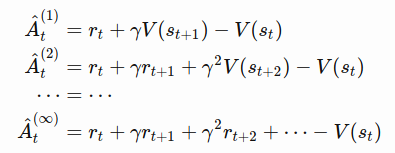
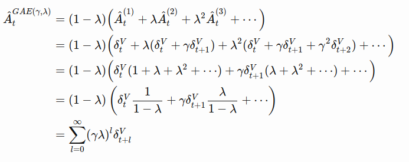

π,γ  
https://arxiv.org/abs/1506.02438  
https://danieltakeshi.github.io/2017/04/02/notes-on-the-generalized-advantage-estimation-paper/

Advantage function: Aπ,γ(st, at) = Qπ,γ(st, at) - Aπ,γ(st)  

Now assume we have some function V which attempts to approximate the true value function Vπ (or Vπ,γ in the undiscounted setting).

Note I: V is not the true value function. It is only our estimate of it, so Vϕ(st)≈Vπ(st). I added in the ϕ subscript to indicate that we use a function, such as a neural network, to approximate the value. The weights of the neural network are entirely specified by ϕ

Note II: we also have our policy πθ parameterized by parameters θ, again typically a neural network. For now, assume that ϕ and θ are separate parameters; the authors mention some enticing future work where one can share parameters and jointly optimize. The combination of πθ and Vϕ with a policy estimator and a value function estimator is known as the actor-critic model with the policy as the actor and the value function as the critic.

## Advantage function estimators

small k => low variance, high bias  
large k => high variace, low bias  
=> how to make use of the k-step returns in practice ?

## Generalized Advantage Estimator
TD residual: δVt=rt + γV(st+1)−V(st)
  
=> The result is the exponentially-decayed sum of residual terms.

λ ∈ [0,1]. Var(GAE(γ,1))>Var(GAE(γ,0)) due to the number of terms in the summation (more terms usually means higher variance),  
γ determines thescale of the value function Vπ,γ  
λ adjusts the bias-variance tradeoff   
=> why we need to have both γ and λ ?, we can merge them into one constant  
According to the author, best value of λ is much lower than the best value of γ