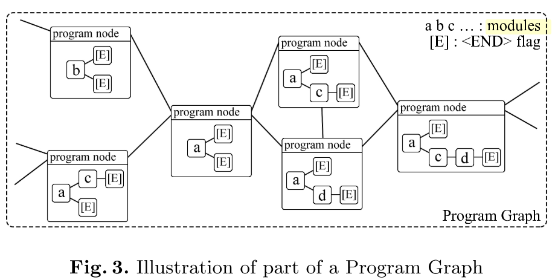
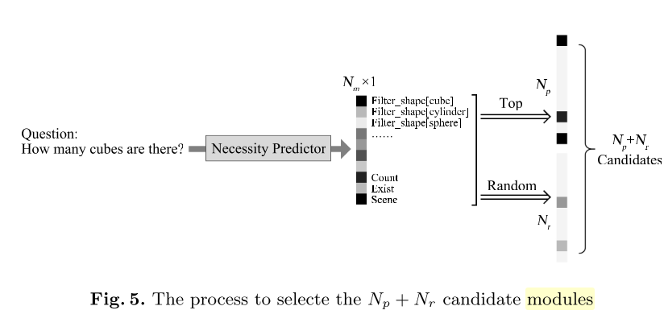

## Issues
- Neural model network for solving VQA isn't differentiable

## Propose
- Heuristic search on the PROGRAM GRAPH to discover optimal program, without ground-truth programs

## Contribute
- Do not require ground-truth programs
- Program graph: data structure represent the space of possible programs
- Candidate Selection: narrow down the search space

## Related works
- Supervised: require ground-truth programs
- Reinforcement learning: large search space

## Proposed Method
### Method overview

- Find optimal program through heuristic search on Program Graph.
- The most apporitate program is used as label to train Program Predictor

### Traning program predictor

### Program graph
- Is a tree
    - Each non-leaf nodes stands for a module
    - Number of node's children equal to the number of inputs
- A program can be represented as a sequence of modules (pre-order tree traversal)
- Program graph represent the relation between all programs that have been reached through searching process
    - Each node is a unique program
    - Two node is connected if edit distance is one
    - Each node has a score - output prob predicted by Program predictor

### Graph-based heuristic search
- Select node with highest Expectation score -> expand from this node -> repeat until meet terminate condition
- Operation to expand program: Insert, Delete, Substitute

### Candidate selection
- Select only a subset of modules to generate programs
- Input: (Question + best program found in search)
- Output: prob
