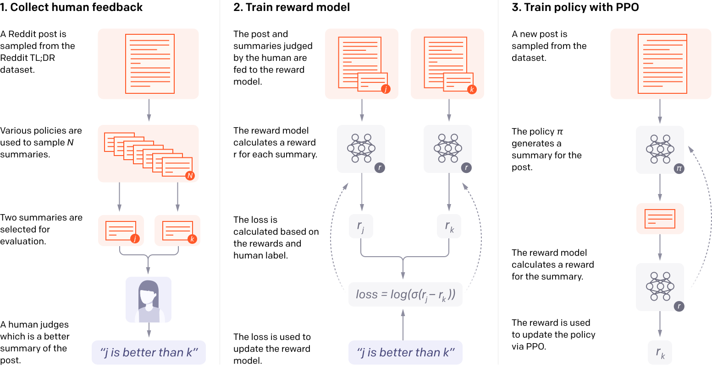

https://arxiv.org/abs/2009.01325

# Method
- Extractive

# Dataset
- TL;DR dataset

# Metrics:

# Conclusion
- Better than summarize from 10x larger model trained with supervised learning

1. train initial summarization model
2. collect dataset of human comparision between summaries
3. training a reward model to predict the human-preferred summary
4. fine-tune summarization model with RL to get high reward

model: take a GPT model