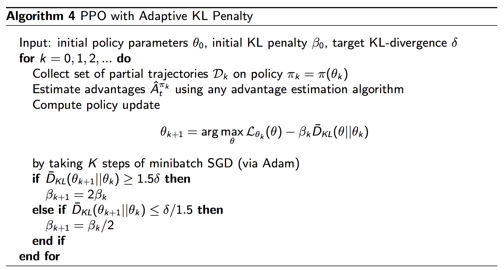

## Problems:
-  natural policy gradient involves a second-order derivative matrix which makes it not scalable for large scale problems.

## Contributions:
- Make the first order derivative solution, like the gradient descent, closer to the second-order derivative solution by adding soft constraints.

### PPO use penalized KL instead of contrained KL as TRPO

β controls the weight of the penalty. It penalizes the objective if the new policy is different from the old policy. Borrow a page from the trust region, we can dynamically adjust β. d below is the KL-divergence between the old and the new policy. If it is higher than a target value, we shrink β. Similarly, if it falls below another target value, we expand the trust region.

### PPO with clipped objective
we maintain two policy:
- current policy that we want to refine
- last policy to collect samples  
However, difference between current and old policy getting larger through iteration (outside the range (1 — ε) and (1 + ε)). So for every 4 iteratils, we assign old policy to refined policy  
With clipped objective, we compute a ratio between the new policy and the old policy:   

if new policy is much different from the old one => clip estimated advantage function

