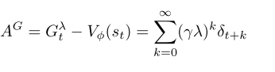
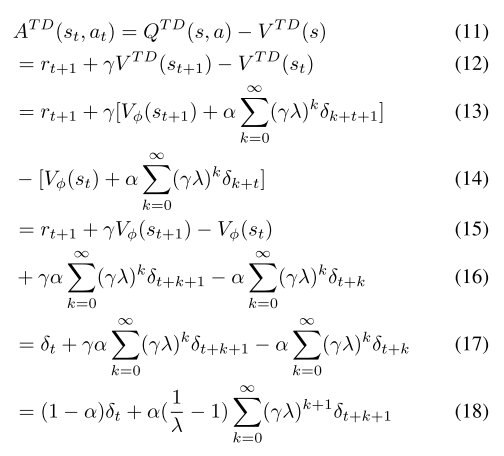

# Soft policy optimization using dual-track advantage estimator

## Current issues
- model-free RL are sample inefficiency, require tons of samples
- difficult to converge and sensititve to hyper-parameters

## Contribution
- Entropy term balance the exploration and exploitation (soft policy optimization). Explore more states in the initial stage, and exploit explored policy to find more returnable trajectories
- Combine TD learning (faster convergence) and GAE (reduce variance)

## Method

α is update coefficient

 
 

### TD advantage estimator (TDAE)

TDAE (equation 11) contains both value from value network and TD => TDAE is more varied than GAE  
Hyperparams: alpha, lambda, gamma

 
 

### Dual-track advantage estimator (DTAE)
In early stage, the agent tends to adpot the action with higher randomness rather than action with maximal return predicte by current policy. So the increment speed of return is slow, the solution is increate the convergence speed of value function.

??? Why TDAE is based on previous policy ? Is it just a trick to decorrelate two network ?

??? How to backprop these two ?  
- Copy weight from current policy to previous plicy
- Backprop on current policy

## Soft policy optimization
- Expectation: high entropy => policy distribution is uniform => each state can be traversed as much as possible => maximium entropy objective

H(π(st)) is the Shannon entropy of the policy distribution parameter. η determines the relative importance of the entropy term against the reward.

### Entropy-based function: 

- rH(st, at) = r(st, at)+ηEst+1∼pH(π(st+1))

### Objective

optimize (similar to PPO, just added entropy term)  
... on going ...

## Term:
α: the update ratio of value function. α=0.1 give best result  
η: the relative importance of reward and entropy.

## Experiment
SPOD without DTAE > PPO  
SDOP without entropy ~ PPO

## References:
https://julien-vitay.net/deeprl/BasicRL.html#sec:temporal-difference
https://github.com/Code-Papers/SPOD     