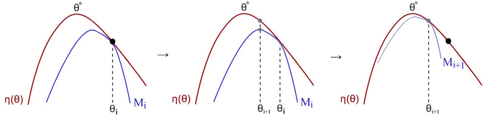

## Problems of Policy gradient
- PG use first-order derivative -> Same as gradient descent, large step destroy learning
- Hard to have proper learning rate
- How to translate the change in the policy space to model params space
- One update per trajectory is not sample efficient

## Minorize - maximization algorithm (MM)
- Research questions: Does any policy update always improve the expected rewards

- => MM iteratively maximize a lower bound function approximating the expected reward locally

η is expected rewards, M is lower bound

## Trust region
- Gradient descent is a line search. We determine the descending direction first and then take a step towards that direction.
- In the trust region, we determnie the maximum step size that we want to explore 