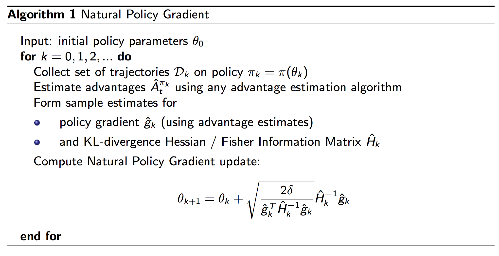
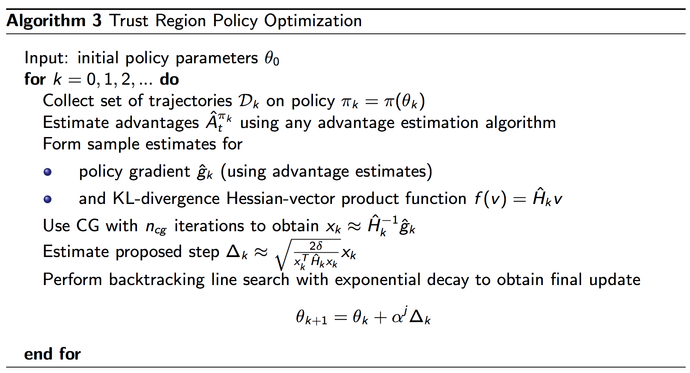

## Problems of Policy gradient
- PG use first-order derivative -> Same as gradient descent, large step destroy learning
- Hard to have proper learning rate
- How to translate the change in the policy space to model params space
- One update per trajectory is not sample efficient

## Minorize - maximization algorithm (MM)
- Research questions: Does any policy update always improve the expected rewards. How can we optimize a policy to maximize the rewards  
=> MM iteratively maximize a lower bound function approximating the expected reward locally

η is expected rewards, M is lower bound

## Trust region optimization
- Gradient descent is a line search. We determine the descending direction first and then take a step towards that direction.
- In the trust region, we determnie the maximum step size that we want to explore. Then we locate the optimal point within this region.

## Importance sampling
In PG, current policy is used to computer PG. So whenever the policy is changed, we collect new samples. Old samples are not reusable. 

- Importance sampling estimates the value functions for a policy π with samples collected previously from an older policy π’. In simple term, calculating the total rewards of taking an action is very expensive. However, if the new action is relatively close to the old one, importance sampling allows us to calculate the new rewards based on the old calculation.

- Importance sampling calucate expected value of f(x) where x has distribution p Ex~p[ *f*(x) ]
- Then sampling from *q*(x) bases on Ex~p[ *f*(x)*p*(x) / *q*(x) ]. It is claimed that we need to resample trajectory frequently (every 4 iterations)

## Natural gradient:
### What is the maximum step size in a trust region ?
=> KL-divergence contrains  
The stepwise in parameter space is determined by considering the KL divergence in the distributions before and after the update
### closed-form

- Hessian matrix 

## TRPO: Important sampling + Trust region optimization + Natural gradient
- Objective function: 
- Use KL-divergence to measure difference between two data distribution p and q  
=> Lower bound for MM algo:  This also establish upper bound error for the objective function => trust region  
=> this equivalent to 
- Use natural policy gradient to caculate learning rate  
- need to verify the ne-7w policy first before commits the change
    - KL-divergence for the new policy θ is ≤ δ and
    - 𝓛(θ) ≥ 0.    
If the verification fails, we will decay the natural policy gradient by a factor of α (0<α<1) until the new parameters meet the requirement above. So appyling linear search to find best step size

